# DOCKER ANDROID WITH SELENIUM GRID EXAMPLE 

This project shows how to run **tests in parallel** on two or more devices through **docker** containers and **selenium grid**. This mode only works on Android Emulators since iOS native libraries doesn't support docker.
Also, this repository has been created with the intention to run tests on any OS and to be incluided into a pipeline with Jenkins for CI/CD purposes. It's worth to mention that this project doesn't requiere any previous installation but docker and a virtual machine (only if you are on a MAC or Windows).

**Note**: Due performance limitations, in most of the cases tests will run (with no issues) on two devices at your localhost. If you want to run tests on three or more devices is recommended to integrate this project into a cloud service.

#### ABOUT THIS REPOSITORY
The design and implementation is based on the next existing repositories:
- https://github.com/budtmo/docker-android --> docker-android documentation
- https://github.com/SeleniumHQ/docker-selenium --> docker-selenium documentation 

Also, this repository contains:
- **Gradle** as build tool
- **TestNG** as test runner and test report
- **Java** as programming language
- **Appium** as mobile test framework

***Note***: The example apk used in this project is provided from this repository: https://github.com/cloudgrey-io/the-app 

> Docker + Selenium Grid Architecture

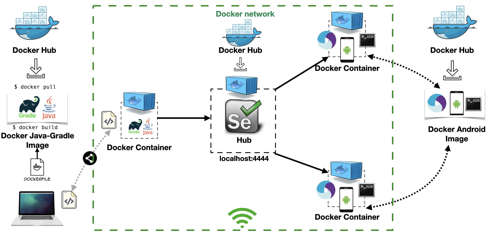

## MAC OSX

#### GETTING STARTED

**Note**: The next steps are meant to be run only once 
- **Prerequisites:**
    - Docker version 19.03.8 or newer
    - VMware Fusion Versión 11.5.3
- **Installation Steps:**
    - Docker for Mac
        - Please follow the steps from the official docker site. `Install Docker Desktop on Mac` : <https://docs.docker.com/docker-for-mac/install/> 
    - VMware Fusion on OSX
        1) Install docker-machine via Homebrew: `brew install docker-machine`
        2) Install docker-machine-parallels via Homebrew: `brew install docker-machine-parallels`
        3) Install VMware Fusion: `brew cask install vmware-fusion`
        4) Download and install **VMware Fusion 11.5.3** application for Mac from this [link](https://www.vmware.com/products/fusion/fusion-evaluation.html) 
            - ***Note***: a permanent free version can be downloaded from this [site](https://fishermansite.mx/mac/descarga-vmware-fusion-pro-11-0-2-para-mac/)  
- **Settings:**
    1) Clone the docker project on your local machine: `git clone git@github.com:LerryAlexander/docker-android-selenium-grid.git` 
        - 1.a) Set root permissions to the project folder in order to be able to share files between docker containers and local project: 
            - `sudo chmod -R a+rwx /<path_to_your_project_folder>/docker-android-selenium-grid/`
    2) Create a virtual machine of VMware Fusion for running docker project: `sudo docker-machine create --driver=vmwarefusion vmware-dev`
    3) Setup the virtual machine:
        - 3.a) Stop the vm: `sudo docker-machine stop vmware-dev` 
        - 3.b) Open VMware Fusion app from your local applications folder
        - 3.c) Go to the Menu and select *Archivo -> Abrir*. Go to next path */Users/[youruser]/.docker/machine/machines/vmware-dev/* and open the *vmware-dev.vmdk* file
        - 3.d) Share your local project root path with the VM:
            - 3.d.1) Go to the Menu, select *Maquina Virtual -> Configuracion...* 
            - 3.d.2) Click on *Compartir* folder. Click on *+* button and select your local project root path. (see image below)
            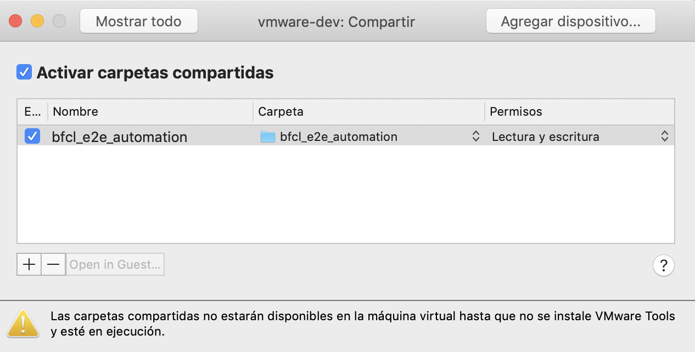
        - 3.e) Select Virtualizacion remota mediante VNC option:
            - 3.e.1) Go to the Menu bar, select *Maquina Virtual -> Configuracion...* 
            - 3.e.2) Click on *Avanzado* and check `Virtualizacion remota mediante VNC` option (see image below)
            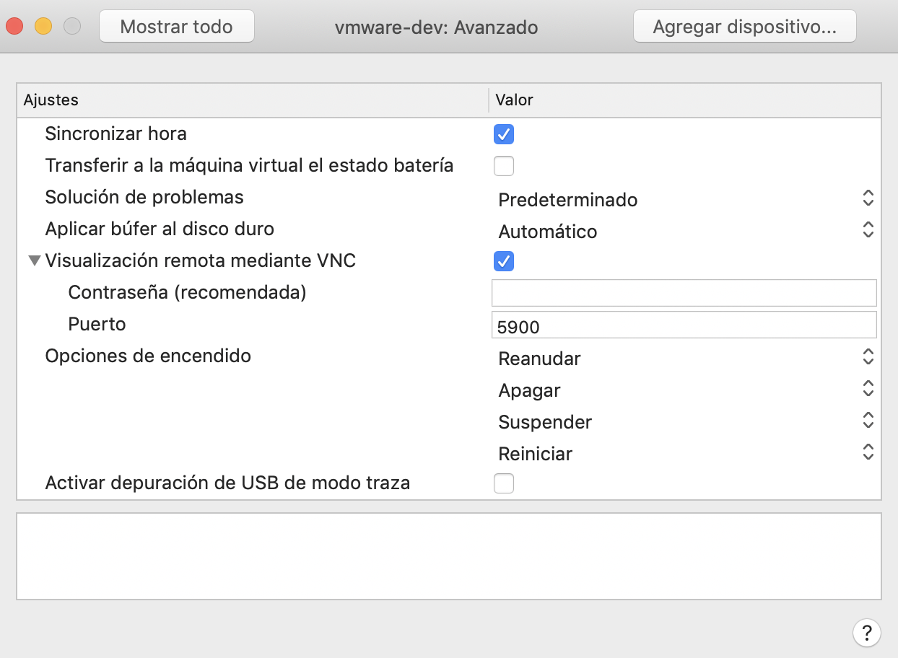
        - 3.f) Enable nested virtualization for VMware Fusion:
            - 3.f.1) Go to the Menu bar, select *Maquina Virtual -> Configuracion...*
            - 3.f.2) Click on Processors and Memory, expand Advanced options, and select `Enable hypervisor applications in this virtual machine`.
            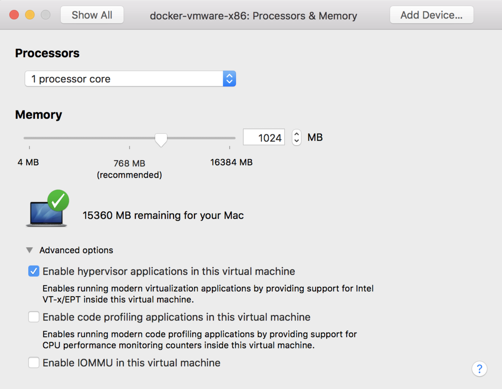
        - 3.g) Go to Terminal, and start the VM: `sudo docker-machine start vmware-dev` 
            - 3.g.1) Run: `sudo docker-machine env vmware-dev` command
            - 3.g.2) Run: `eval $(sudo docker-machine env vmware-dev)` command
        - 3.h) Get inside the VM: `sudo docker-machine ssh vmware-dev`
        - 3.i) Enable kvm inside virtual machine:
            - 3.i.1) Run as an account other than root to install kvm packages using tce-load. 
                - Run `su docker` (type *tcuser* for password)
                - Run  `tce-load -wi kvm`
        - 3.j) Run as root to load kvm module after kvm packages install. `sudo modprobe kvm_intel`
        - 3.k) Check if the kvm device is loaded. `ls /dev/kvm`
        - 3.l) Check if your CPU supports hardware virtualization now. `egrep -c '(vmx|svm)' /proc/cpuinfo`. If **0** it means that your CPU doesn't support hardware virtualization. If **1** or more it does - but you still need to make sure that virtualization is enabled in the BIOS.
        - **Note:** For more detail info about installing and setting up VM for running docker-android projects visit [budtmo/docker-android](https://github.com/budtmo/docker-android/blob/master/README_VMWARE.md)
        - 3.m) Install `docker-compose` for Linux (since VM kernel is based on Linux)
            - 3.m.1) Run this command to download the current stable release of Docker Compose: 
                - Run: `sudo curl -L "https://github.com/docker/compose/releases/download/1.25.4/docker-compose-$(uname -s)-$(uname -m)" -o /usr/local/bin/docker-compose`
            - 3.m.2) Apply executable permissions to the binary: 
                - Run: `sudo chmod +x /usr/local/bin/docker-compose`
        - **Note:** If you run with problems installing docker-compose visit the section *Install Compose on Linux systems* [here](https://docs.docker.com/compose/install/) 

#### RUNNING TESTS ON MAC OSX

In order to run tests we need to start the virtual machine and get inside of it. This can be done either from your local Terminal or from VMware Fusion application installed previously on your Mac.
In this case we are going to do it from local terminal since not opening VMware Fusion app we reduce consuming unnecessary resources.

1. Go to Terminal, and start the VM: 
    - Run: `sudo docker-machine start vmware-dev` 
    - Run: `eval $(sudo docker-machine env vmware-dev)` 
    - Run: `sudo docker-machine env vmware-dev`
2. Get inside the VM: 
    - Run: `sudo docker-machine ssh vmware-dev`
3. Go to your shared local root project folder:
    - Run: `cd /mnt/hgfs/docker-android-selenium-grid/`
4. Create a docker base image based on the **Dockerfile** which will contain **gradle 4.8** and **Java 9** for running android tests. This image will also store the entire source code from **bfcl_e2e_automation**, so be sure the project is updated with last changes.
    - Run: `docker build -t test_container .`
5. Run automated tests:
    - `docker-compose up -d`

#### CHECKING TESTS EXECUTON ON MAC OSX
Since tests on Mac are running from the virtual machine it is neccessary to find out the VM  IP address

1. Get the VM IP address (outside VM):
    - Run: `sudo docker-machine ip vmware-dev`

2. See selenium grid console from web browser:
    - `http://<vm_ip_address_here>:4444/grid/console` (for example: `http://192.168.214.128:4444/grid/console`)
    
    > Selenium grid console (reference image)

    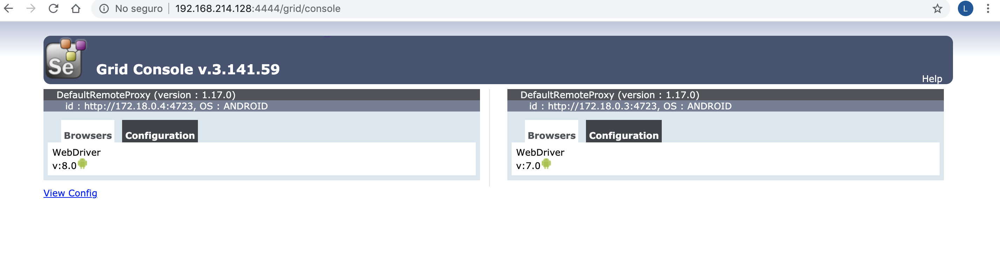
    
3. See android emulators running from web browser:
    -  `http://<vm_ip_address_here>:6080/` (for example: `http://192.168.214.128:6080/` we get Samsung Galaxy S6 running on screen)
    -  `http://<vm_ip_address_here>:6081/` (for example: `http://192.168.214.128:6081/` we get Samsung Galaxy S10 running on screen)

    > Samsung Galaxy S6 (Android Emulator V6.0)
    
    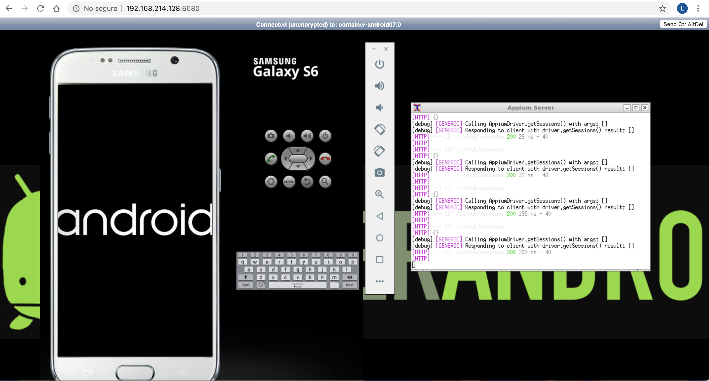
    
    > Samsung Galaxy S10 (Android Emulator V10.0)
    
    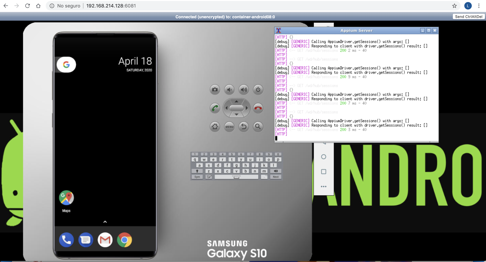
    
## LINUX UBUNTU 18.04.4

#### GETTING STARTED
**Note**: The next steps are meant to be run only once 
- **Prerequisites:**
    - Docker version 19.03.6 or newer
    - docker-compose 1.13.0 or newer
- **Installation Steps:**
    - Docker (from Terminal):
        - Run: `sudo snap install docker`
    - docker-compose (from Terminal):
        - Run: `sudo apt install docker-compose` 
- **Settings:**
    - Clone the docker project on your local machine (if you've already done it, skip this step): 
        - `git clone git@github.com:LerryAlexander/docker-android-selenium-grid.git` 
    - Set root permissions to the project folder in order to be able to share files between docker containers and local project: 
        - `sudo chmod -R a+rwx /<path_to_your_project_folder>/docker-android-selenium-grid/`

#### RUNNING TESTS ON LINUX UBUNTU

From your local terminal:

1. Go to the project root folder:
    - Run: `cd ~/<path_to_your_root_project_folder>/docker-android-selenium-grid/` (for example, in my case is `cd ~/eclipse-workspace/bfcl_e2e_automation/`)
2. Create a docker base image basd on the **Dockerfile** which will contain **gradle 5.2.1** and **Java 8** for running android tests. This image will also store the entire source code from **docker-android-selenium-grid/**
    - Run: `sudo docker build -t container-test .` 
    **Note:** This execution will take a few minutes since it is creating the image for running the tests.
3. Run automated tests:
    - `sudo docker-compose up -d`

#### CHECKING TESTS EXECUTON ON LINUX UBUNTU

1. See selenium grid console from web browser:
    - `http://localhost:4444/grid/console`
    
    > Selenium grid console 

    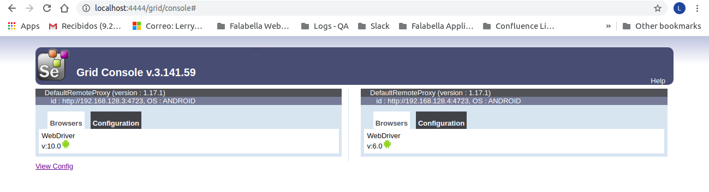
    
2. See android emulators running from web browser:
    -  `http://localhost:6080/` (we get Samsung Galaxy S6 running on screen)
    -  `http://localhost:6081/` (we get Samsung Galaxy S7 running on screen)
    
    > Samsung Galaxy S6 (Android Emulator V6.0)
    
    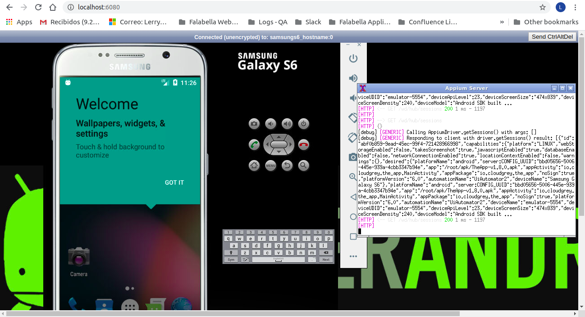
    
    > Samsung Galaxy S10 (Android Emulator V10.0)
    
    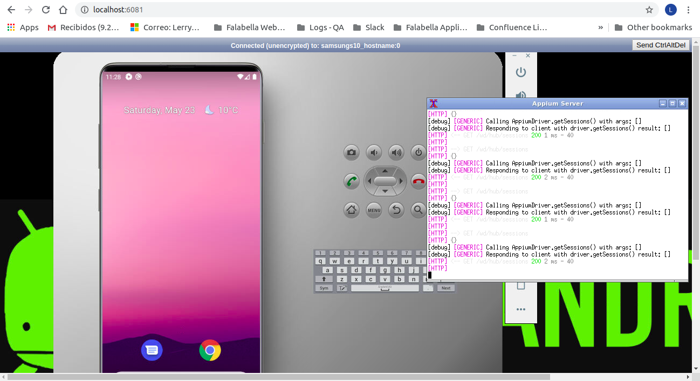

#### SEE TESTS RESULTS ###

In order to see tests results we can check either TestNG reports and video executions from docker-android:

- Go to path `tests-output/testngOutput/` and from here we can check `index.html` and `emailable-report.html`
 
    > TestNG reports - emailable-report.html
    
    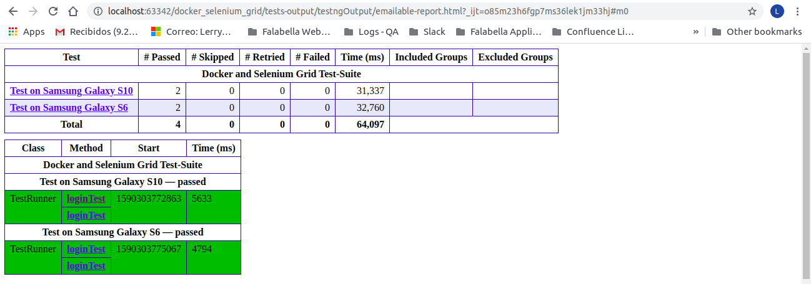 
    
    > TestNG reports - index.html
                                                                                                                                                                                                                                             
    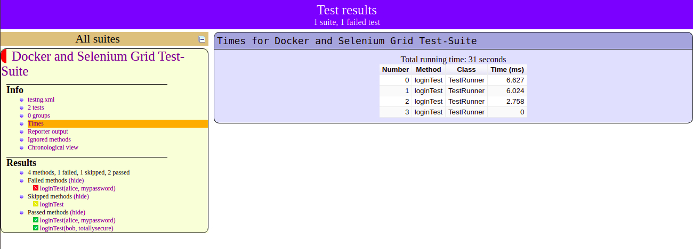
    
- Go to path `tests-output/video/` and there should be the historical video executions for each device:

    > Samsung Galaxy S6 - Video execution
    
    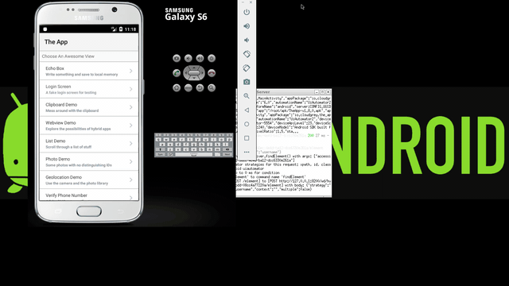
                                                                                                           
    > Samsung Galaxy S10 - Video execution                                                                                                   
        
    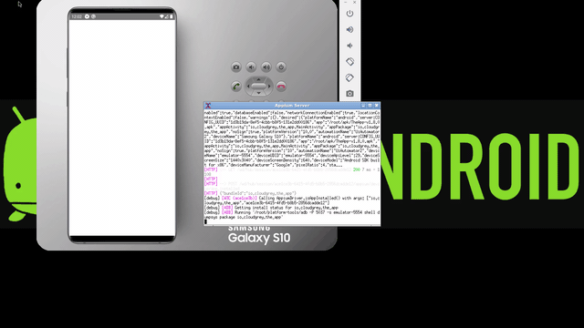                                                                                                                                                                                                                                                                                                                                                                                                                                                                                                                                                                                                                  